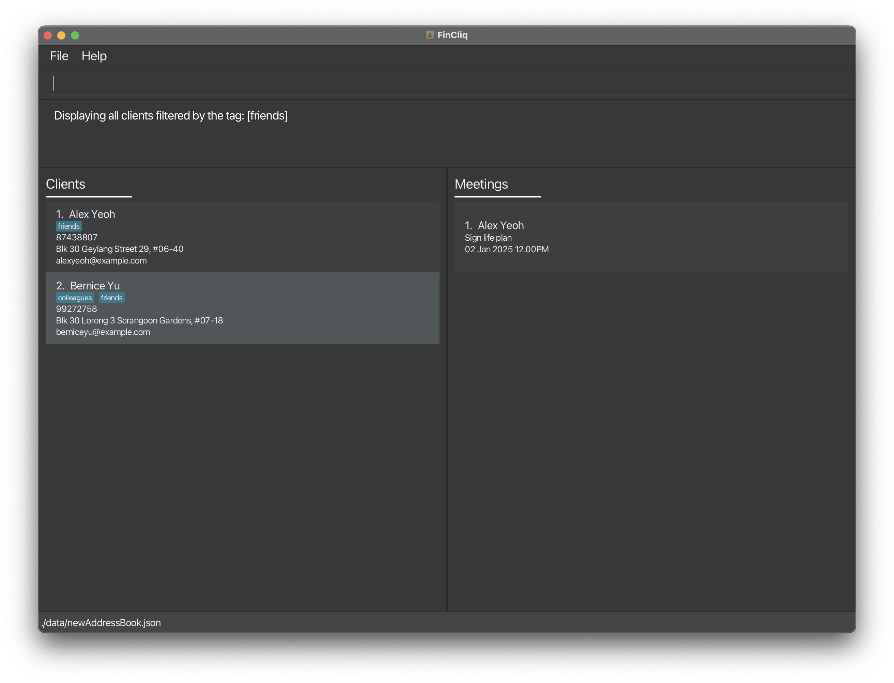
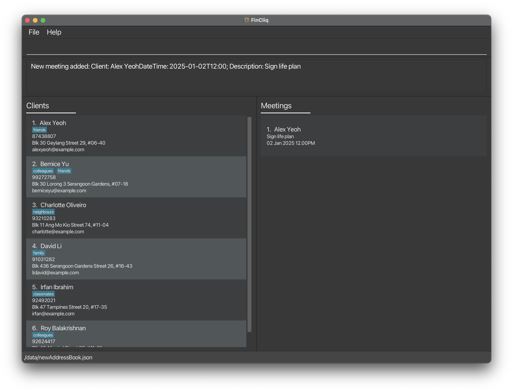
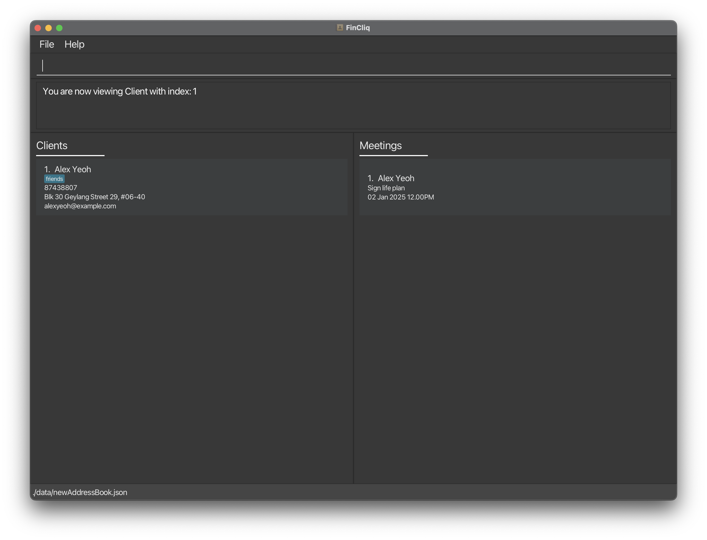
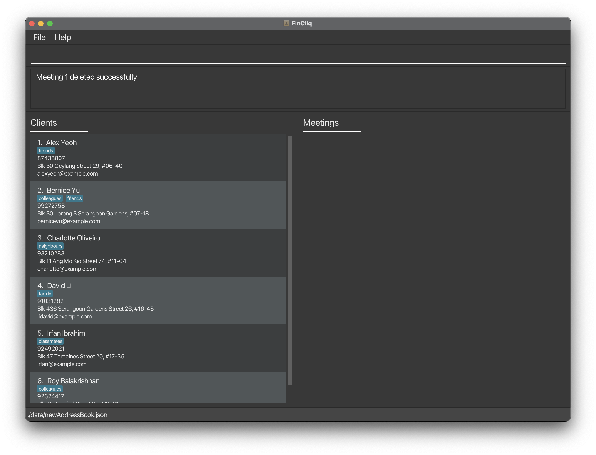

FinCliq is a **desktop app for financial advisors to manage contacts and meetings, optimized for use via a Command Line Interface** (CLI) while still having the benefits of a Graphical User Interface (GUI). If you can type fast, FinCliQ can get your contact management tasks done faster than traditional GUI apps.

---
## Table of contents

* Table of Contents
{:toc}

---

## Quick start

1. Ensure you have Java `11` or above installed in your Computer.

1. Download the latest `fincliq.jar` from [here](https://github.com/AY2324S2-CS2103-F08-1/fincliq/releases).

1. Copy the file to the folder you want to use as the _home folder_ for your own personal FinCliq application.

1. Open a command terminal, `cd` into the folder you put the jar file in, and use the `java -jar fincliq.jar` command to run the application. 
   A GUI similar to the below should appear in a few seconds. Note how the app contains some sample data. 
   

1. Type the command in the command box and press Enter to execute it. e.g. typing **`help`** and pressing Enter will open the help window. 
   Some example commands you can try:

    - `list` : List all clients.

    - `add n/John Doe p/98765432 e/johnd@example.com a/John street, block 123, #01-01` : Adds a contact named `John Doe` to the Address Book.

    - `delete 3` : Deletes the 3rd clients shown in the current list.

    - `clear` : Deletes all clients.

    - `exit` : Exit the app.

1. Refer to the [Features](#features) below for details of each command.

---

## Features

**:information_source: Notes about the command format:** 

- Words in `UPPER_CASE` are the parameters to be supplied by the user. 
  e.g. in `add n/NAME`, `NAME` is a parameter which can be used as `add n/John Doe`.

- Items in square brackets are optional. 
  e.g `n/NAME [t/TAG]` can be used as `n/John Doe t/friend` or as `n/John Doe`.

- Items with `…`​ after them can be used multiple times including zero times. 
  e.g. `[t/TAG]…​` can be used as ` ` (i.e. 0 times), `t/friend`, `t/friend t/family` etc.

- Parameters can be in any order. 
  e.g. if the command specifies `n/NAME p/PHONE_NUMBER`, `p/PHONE_NUMBER n/NAME` is also acceptable.

- Extraneous parameters for commands that do not take in parameters (such as `help`, `list`, `exit` and `clear`) will be ignored. 
  e.g. if the command specifies `help 123`, it will be interpreted as `help`.

- If you are using a PDF version of this document, be careful when copying and pasting commands that span multiple lines as space characters surrounding line-breaks may be omitted when copied over to the application.

**:information_source: Notes about the command input format:** 

* Spacing of values:
    * Leading and trailing spaces of input values will be removed.

* `NAME` format:
    * Can only contain alphabetical characters and spaces.
    * Cannot be blank.
    * Extra spaces between values will be processed as a single space.

* `PHONE_NUMBER` format:
    * Must follow the standard Singapore telephone numbers (i.e. 9XXXXXXX or 8XXXXXXX).
    * Spaces between numbers will be ignored.

* `EMAIL` format:
    * Must follow the standard email address format (i.e. example@example.com).

* `ADDRESS` format:
    * Can only consist of alphanumeric characters, whitespace and the following set of characters: ``#-(),``.
    * Cannot be blank.

* `TAG` format:
    * Can only consist of alphanumeric characters.
    * Must be a single word

* `DATE_TIME` format:
    * Must follow the format `YYYY-MM-DD HH:MM` (i.e. `02-01-2025 12:00`).

### Viewing help : `help`

Shows a message explaining how to access the help page.

Format: `help`

## Client Functions

### Adding a client: `add`

Adds a client to the address book.

Format: `add n/NAME p/PHONE_NUMBER e/EMAIL a/ADDRESS [t/TAG]…​`

:bulb: **Tip:**
A client can have any number of tags (including 0)

Examples:

- `add n/John Doe p/98765432 e/johnd@example.com a/John street, block 123, #01-01`
- `add n/Betsy Crowe t/friend e/betsycrowe@example.com a/Newgate Prison p/1234567 t/criminal`

### Listing all clients : `list`

Shows a list of all clients in the address book.

Format: `list`

### Editing a client : `edit`

Edits an existing client in the address book!

Format: `edit INDEX [n/NAME] [p/PHONE] [e/EMAIL] [a/ADDRESS] [t/TAG]…​`

- Edits the client at the specified `INDEX`. The index refers to the index number shown in the displayed client list. The index **must be a positive integer** 1, 2, 3, …​
- At least one of the optional fields must be provided.
- Existing values will be updated to the input values.
- When editing tags, the existing tags of the client will be removed i.e adding of tags is not cumulative.
- You can remove all the client’s tags by typing `t/` without
  specifying any tags after it.

Examples:

- `edit 1 p/91234567 e/johndoe@example.com` Edits the phone number and email address of the 1st client to be `91234567` and `johndoe@example.com` respectively.
- `edit 2 n/Betsy Crower t/` Edits the name of the 2nd client to be `Betsy Crower` and clears all existing tags.

### Locating clients by name: `find`

Finds persons whose names contain any of the given keywords.

Format: `find KEYWORD [MORE_KEYWORDS]`

- The search is case-insensitive. e.g `hans` will match `Hans`
- The order of the keywords does not matter. e.g. `Hans Bo` will match `Bo Hans`
- Only the name is searched.
- Only full words will be matched e.g. `Han` will not match `Hans`
- Persons matching at least one keyword will be returned (i.e. `OR` search).
  e.g. `Hans Bo` will return `Hans Gruber`, `Bo Yang`

Examples:

- `find John` returns `john` and `John Doe`
- `find alex david` returns `Alex Yeoh`, `David Li` 
  

### Deleting a client : `delete`

Deletes the specified client from the address book.

Format: `delete INDEX`

- Deletes the client at the specified `INDEX`.
- The index refers to the index number shown in the displayed client list.
- The index **must be a positive integer** 1, 2, 3, …​

Examples:

- `list` followed by `delete 2` deletes the 2nd client in the address book.
- `find Betsy` followed by `delete 1` deletes the 1st client in the results of the `find` command.

### Filter client by tag : `filter`
Filter through clients by a specific tag provided.

Format: `filter TAG`

- `TAG` refers to the tag given to clients
- Displays all clients with the specified tag
- There should only be one tag provided else an error would be shown
- Tags should be a single word only 

Examples:
- `filter friends` Displays all clients with the tag `friends`
- 

## Meeting Functions

### Adding a Meeting: `addMeeting`

Adds a meeting for a specific client in the address book.

Format: `addMeeting clientIndex/CLIENT_INDEX dt/DATE_TIME d/DESCRIPTION`

- `CLIENT_INDEX` refers to the index number shown in the displayed client list. The index **must be a positive integer** 1, 2, 3, …​.
- `DATE_TIME` format should be `YYYY-MM-DD HH:MM`, e.g., `02-01-2025 12:00`. It should also not
  be before the current date and time.
- `DESCRIPTION` refers to what the meeting is about. Format should be a single string.

Examples:

- `addMeeting clientIndex/1 dt/02-01-2025 12:00 d/Sign life plan` Adds a meeting with description "Sign life plan" and meeting date 02-01-2025 12:00 to client with index 1.
- `addMeeting clientIndex/2 dt/06-01-2025 15:00 d/Meeting to discuss finances` Adds a meeting with description "Meeting to discuss finances" and meeting date 06-01-2025 15:00 to client with index 2. 
  
- 
### Listing all Meetings for a Client: `view c`

Shows a list of all meetings for a specific client.

Format: `view c CLIENT_INDEX`

- `CLIENT_INDEX` refers to the index number shown in the displayed client list. The index **must be a positive integer** 1, 2, 3, …​.

Example:

- `view c 1` Lists all meetings of the first client. 
  

### Editing a Meeting: `editMeeting`

Edits an existing meeting for a client.

Format: `editMeeting clientIndex/CLIENT_INDEX meetingIndex/MEETING_INDEX n/DESCRIPTION dt/DATE_TIME`

- Edits the meeting specified by `MEETING_INDEX` for the client specified by `CLIENT_INDEX`. Both indexes must be positive integers 1, 2, 3, …​.
- All the fields (clientIndex, meetingIndex, description, datetime), must be provided.
- Existing values will be updated to the input values.
- When editing descriptions, the existing descriptions of the meeting will be removed i.e adding of descriptions is not cumulative.
- Do note that the prefix for meeting description here is "n/", not "d/". Future enhancements will include standardising prefixes across different commands.

Examples:

- `editMeeting clientIndex/1 meetingIndex/2 n/starbucks meeting dt/01-01-2024 12:00` Edits the description and date/time of the 2nd meeting of the 1st client. 
  

### Deleting a Meeting: `deleteMeeting`

Deletes a specific meeting for a client.

Format: `deleteMeeting clientIndex/CLIENT_INDEX meetingIndex/MEETING_INDEX`

- Deletes the meeting specified by `MEETING_INDEX` for the client specified by `CLIENT_INDEX`. Both indexes must be positive integers 1, 2, 3, …​.

Example:

- `deleteMeeting clientIndex/1 meetingIndex/1` Deletes the first meeting for the first client. 
  

### Clearing all entries : `clear`

Clear all entries from the address book.

Format: `clear`

### Exiting the program : `exit`

Exits the program.

Format: `exit`

### Saving the data

AddressBook data are saved in the hard disk automatically after any command that changes the data. There is no need to save manually.

### Editing the data file

FinCliq data are saved automatically as a JSON file `[JAR file location]/data/addressbook.json`. Advanced users are welcome to update data directly by editing that data file.

:exclamation: **Caution:**
If your changes to the data file makes its format invalid, FinCliq will discard all data and start with an empty data file at the next run. Hence, it is recommended to take a backup of the file before editing it. 
Furthermore, certain edits can cause the AddressBook to behave in unexpected ways (e.g., if a value entered is outside of the acceptable range). Therefore, edit the data file only if you are confident that you can update it correctly.

---

## FAQ

**Q**: How do I use the app? 
**A**: This app is designed to help you keep track of your clients and meetings with them.  
To keep track of your clients/meetings, you can follow the various commands in the user guide and enter the commands according to the specified format.

**Q**: Is there a limit to the number of clients/meetings I can store in the app 
**A**: No, there is no limit to the number.

**Q**: Are the clients/meetings storage persistent between application restarts? 
**A**: Yes. We have implemented a storage feature that would populate the information inside the address book based on a .json file.

**Q**: When entering my name, some characters do not show up. Is this the intended behaviour? 
**A**: Yes, currently, only our app only supports english names, although we intend to support this in the future.

**Q**: I entered a date and time that was before the current time and it fails to add. Is this
the intended behaviour? 
**A**: Yes. We implemented this so that people would not enter meetings that occur in the past.

---

## Known issues

1. **When using multiple screens**, if you move the application to a secondary screen, and later switch to using only the primary screen, the GUI will open off-screen. The remedy is to delete the `preferences.json` file created by the application before running the application again.
2. **When entering a command with an invalid format**, the application will prompt you to re-enter the command while providing the correct format to follow.

---

## Command summary

### Client Functions

| Action     | Format, Examples                                                                                                                                                     |
|------------|----------------------------------------------------------------------------------------------------------------------------------------------------------------------|
| **Add**    | `add n/NAME p/PHONE_NUMBER e/EMAIL a/ADDRESS [t/TAG]…`   e.g., `add n/James Ho p/22224444 e/jamesho@example.com a/123, Clementi Rd, 1234665 t/friend t/colleague` |
| **List**   | `list`  e.g., `list`                                                                                                                                              |
| **Edit**   | `edit CLIENT_INDEX [n/NAME] [p/PHONE_NUMBER] [e/EMAIL] [a/ADDRESS] [t/TAG]…`  e.g.,`edit 2 n/James Lee e/jameslee@example.com`                                    |
| **Delete** | `delete CLIENT_INDEX`  e.g., `delete 3`                                                                                                                       |
| **Find**   | `find KEYWORD [MORE_KEYWORDS]`  e.g., `find James Jake`                                                                                                           |
| **Filter** | `filter TAG_NAME`  e.g., `filter friends`                                                                                                                         |

### Meeting Functions

| Action     | Format, Examples                                                                                                                                                                       |
|------------|----------------------------------------------------------------------------------------------------------------------------------------------------------------------------------------|
| **Add**    | `addMeeting clientIndex/CLIENT_INDEX dt/DATE_TIME d/DESCRIPTION` e.g., `addMeeting clientIndex/1 dt/02-01-2025 12:00 d/Sign life plan`                                              |
| **View**   | `view c CLIENT_INDEX` e.g., `view c 2`                                                                                                                                              |
| **Edit**   | `editMeeting clientIndex/CLIENT_INDEX meetingIndex/MEETING_INDEX n/DESCRIPTION d/DATE_TIME` e.g.,`editMeeting clientIndex/1 meetingIndex/2 n/starbucks meeting dt/01-01-2024 12:00` |
| **Delete** | `deleteMeeting clientIndex/CLIENT_INDEX meetingIndex/MEETING_INDEX` e.g., `deleteMeeting clientIndex/2 meetingIndex/1`                                                              |

### General Functions

| Action    | Format, Examples |
|-----------|------------------|
| **Clear** | `clear`          |
| **Help**  | `help`           |
